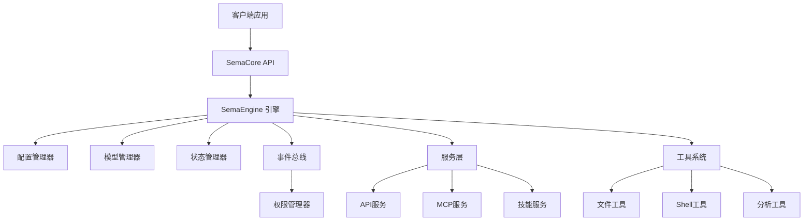
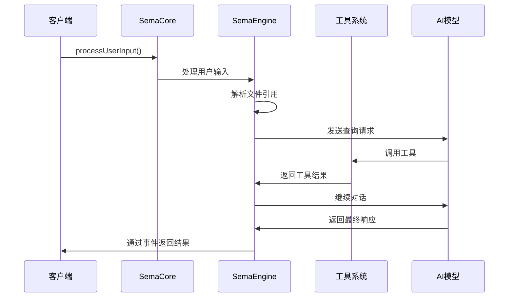

# Sema Core 快速入门指南

## 概述

Sema Core 是一个事件驱动的 AI 助手核心库，专为构建智能编程助手而设计。它提供了完整的会话管理、工具系统、模型管理和事件通信机制，让开发者能够快速构建功能强大的 AI 助手应用。

### 核心特性

- **事件驱动架构**：基于发布-订阅模式的事件系统，支持实时响应和状态同步 (core-0108-temp/src/events/EventSystem.ts:1-137)
- **模块化工具系统**：内置多种编程工具，支持文件操作、代码分析、Shell 执行等 (core-0108-temp/src/tools/base/tools.ts:1-127)
- **智能会话管理**：支持会话历史、上下文管理和中断恢复 (core-0108-temp/src/core/SemaEngine.ts:1-337)
- **多模型支持**：统一的模型管理接口，支持 OpenAI、Anthropic 等多种 AI 提供商 (core-0108-temp/src/core/ModelManager.ts:1-292)
- **权限控制系统**：细粒度的工具权限管理，确保安全执行 (core-0108-temp/src/core/PermissionManager.ts:Approx-PermissionManager)

### 设计理念

Sema Core 采用分层架构设计，将复杂的 AI 助手功能分解为可管理的模块：

- **核心层 (Core)**：提供基础的会话管理和引擎功能
- **服务层 (Services)**：处理 API 调用、模型通信和外部集成
- **工具层 (Tools)**：实现具体的功能工具和扩展能力
- **事件层 (Events)**：提供统一的事件通信机制

## 架构设计

### 整体架构



### 核心组件关系

Sema Core 的核心组件通过清晰的接口和事件机制协同工作：

1. **SemaCore** 作为统一的公共 API 入口 (core-0108-temp/src/core/SemaCore.ts:17-91)
2. **SemaEngine** 处理核心业务逻辑和会话流程 (core-0108-temp/src/core/SemaEngine.ts:25-337)
3. **管理器组件** 负责各自领域的状态和配置管理
4. **事件系统** 提供松耦合的组件间通信

### 数据流设计



## 实现详解

### 核心 API 设计

SemaCore 类提供了简洁的公共接口，内部委托给 SemaEngine 处理业务逻辑 (core-0108-temp/src/core/SemaCore.ts:17-26)：

```typescript
export class SemaCore {
  private readonly engine: SemaEngine;
  private configPromise: Promise<void> | null = null;

  constructor(config?: SemaCoreConfig) {
    this.configPromise = getConfManager().setCoreConfig(config || {});
    this.engine = new SemaEngine();
    // 初始化 MCP 管理器
    this.configPromise = this.configPromise.then(async () => {
      await initMCPManager();
    });
  }
}
```

### 会话管理机制

SemaEngine 实现了完整的会话生命周期管理 (core-0108-temp/src/core/SemaEngine.ts:38-87)：

```typescript
async createSession(sessionId?: string): Promise<void> {
  // 1. 完全中止当前会话（如果存在）
  this.interruptSession();
  
  // 2. 清理所有旧会话资源
  this.stateManager.clearAllState();
  
  // 3. 重置状态
  this.stateManager.updateState('idle');
  
  // 4. 初始化新会话
  await this.initialize(sessionId);
  const historyData = await loadHistory(sessionId);
}
```

### 工具系统架构

工具系统采用插件化设计，支持动态加载和扩展 (core-0108-temp/src/tools/base/Tool.ts:13-55)：

```typescript
export interface Tool<TInput extends z.ZodObject<any> = z.ZodObject<any>, TOutput = any> {
  name: string;
  description?: string | (() => string);
  inputSchema: TInput;
  isReadOnly: () => boolean;
  validateInput?: (input: z.infer<TInput>) => Promise<ValidationResult>;
  genResultForAssistant: (output: TOutput) => string;
  call: (input: z.infer<TInput>) => AsyncGenerator<{type: 'result'; data: TOutput}, void, unknown>;
}
```

内置工具包括文件操作、代码分析、Shell 执行等 (core-0108-temp/src/tools/base/tools.ts:23-35)：

- **SkillTool**: 技能管理和执行
- **BashTool**: Shell 命令执行
- **FileEditTool/FileReadTool/FileWriteTool**: 文件操作工具
- **GlobTool/GrepTool**: 文件搜索和内容查找
- **NotebookEditTool/NotebookReadTool**: Jupyter 笔记本支持

### 事件系统实现

事件系统基于发布-订阅模式，提供类型安全的事件通信 (core-0108-temp/src/events/EventSystem.ts:73-137)：

```typescript
export class EventBus implements EventBusInterface {
  private static instance: EventBus | null = null;
  private readonly emitter = new EventEmitter();

  emit<T>(event: string, data: T): boolean {
    return this.emitter.emit(event, data);
  }

  on<T>(event: string, listener: EventListener<T>): this {
    this.emitter.on(event, listener);
    return this;
  }
}
```

### 配置管理系统

配置管理器支持核心配置和项目配置的分离管理 (core-0108-temp/src/core/ConfManager.ts:25-62)：

```typescript
async setCoreConfig(config: SemaCoreConfig): Promise<void> {
  this.coreConfig = config;
  
  // 设置日志级别（优先设置，确保后续日志能正确过滤）
  setLogLevel(config.logLevel || 'info');
  
  // 设置工作目录
  const workingDir = config.workingDir || getCwd();
  this.projecName = workingDir;
  
  // 初始化项目配置（如果不存在）
  const isNewProject = this.initProjectConfig(workingDir);
}
```

### 模型管理机制

模型管理器支持多提供商的统一管理 (core-0108-temp/src/core/ModelManager.ts:44-89)：

```typescript
async addNewModel(config: ModelConfig, skipValidation: boolean = false): Promise<ModelUpdateData> {
  const profile = convertToModelProfile(config);
  
  // 进行API连接测试（可选）
  if (!skipValidation) {
    const testResult = await testApiConnection({
      baseURL: config.baseURL,
      apiKey: config.apiKey,
      modelName: config.modelName
    });
    
    if (!testResult.success) {
      throw new Error(`API连接测试失败: ${testResult.message}`);
    }
  }
}
```

## 代码示例

### 基础使用

```typescript
import { SemaCore } from 'sema-core';

async function basicExample() {
  // 1. 创建 SemaCore 实例
  const sema = new SemaCore({
    workingDir: '/path/to/your/project',
    logLevel: 'info',
    stream: true,
    thinking: false
  });

  try {
    // 2. 创建会话
    await sema.createSession();
    console.log('会话创建成功！');

    // 3. 处理用户输入
    await sema.processUserInput('你好，帮我分析一下这个项目的结构');
    await sema.processUserInput('请帮我修复代码中的bug');

  } catch (error) {
    console.error('操作失败:', error);
  } finally {
    // 4. 清理资源
    await sema.dispose();
  }
}
```

### 事件监听

```typescript
// 监听会话状态变化
sema.on('session:ready', (data) => {
  console.log('会话准备就绪:', data);
});

// 监听消息流
sema.on('message:chunk', (chunk) => {
  if (chunk.type === 'text') {
    process.stdout.write(chunk.delta);
  } else if (chunk.type === 'thinking') {
    console.log('AI思考中...', chunk.delta);
  }
});

// 监听工具权限请求
sema.on('tool:permission:request', (request) => {
  console.log('工具权限请求:', request);
  // 响应权限请求
  sema.respondToToolPermission({
    toolName: request.toolName,
    selected: 'agree'
  });
});
```

### 模型管理

```typescript
// 添加新模型
const modelResult = await sema.addModel({
  provider: 'openai',
  modelName: 'gpt-4',
  baseURL: 'https://api.openai.com/v1',
  apiKey: 'sk-...',
  maxTokens: 4096,
  contextLength: 8192
});

// 切换模型
await sema.switchModel('gpt-4[openai]');

// 获取模型信息
const modelData = await sema.getModelData();
console.log('当前模型:', modelData.modelName);
console.log('可用模型:', modelData.modelList);
```

### 配置管理

```typescript
// 动态更新核心配置
sema.updateCoreConfByKey('stream', false);
sema.updateCoreConfByKey('thinking', true);

// 批量更新配置
sema.updateCoreConfig({
  stream: true,
  thinking: false,
  systemPrompt: '你是一个专业的编程助手',
  customRules: '- 使用中文回答\n- 提供详细的代码注释'
});

// 限制使用的工具
sema.updateUseTools(['FileReadTool', 'FileEditTool', 'BashTool']);
```

## 技术考量

### 性能优化

1. **事件系统优化**: 采用同步事件处理避免异步陷阱 (core-0108-temp/src/events/EventSystem.ts:29-40)
2. **工具缓存**: 使用 memoize 优化工具构建性能 (core-0108-temp/src/tools/base/tools.ts:87-105)
3. **LLM 缓存**: 可选的 LLM 响应缓存机制 (core-0108-temp/src/services/api/queryLLM.ts:Approx-llmCache)

### 安全机制

1. **权限控制**: 工具执行前的权限验证机制
2. **输入验证**: 基于 Zod schema 的严格输入验证 (core-0108-temp/src/tools/base/Tool.ts:21-25)
3. **中断机制**: 支持用户中断长时间运行的操作 (core-0108-temp/src/core/SemaEngine.ts:233-241)

### 错误处理

1. **分层错误处理**: 不同层级的错误捕获和处理
2. **优雅降级**: 组件失败时的功能降级策略
3. **错误事件**: 通过事件系统传递错误信息

### 扩展性设计

1. **插件化工具**: 支持自定义工具的动态加载
2. **MCP 集成**: 支持 Model Context Protocol 扩展
3. **多提供商支持**: 统一的模型接口支持多种 AI 提供商

## 开发指南

### 项目结构

```
sema-core/
├── src/
│   ├── core/           # 核心业务逻辑
│   ├── events/         # 事件系统
│   ├── services/       # 服务层（API、MCP等）
│   ├── tools/          # 工具系统
│   ├── types/          # 类型定义
│   ├── util/           # 工具函数
│   └── constants/      # 常量定义
├── test/               # 测试文件
├── docs/               # 文档
└── dist/               # 编译输出
```

### 开发流程

```bash
# 1. 安装依赖
npm install

# 2. 编译项目
npm run build

# 3. 运行测试
node test/todos.test.js  # 流程测试
node test/tool/grep.test.js  # 工具测试

# 4. 打包发布
npm pack
```

### 自定义工具开发

```typescript
import { Tool } from 'sema-core/tools/base/Tool';
import { z } from 'zod';

export class CustomTool implements Tool {
  name = 'custom_tool';
  description = '自定义工具描述';
  
  inputSchema = z.object({
    input: z.string().describe('输入参数')
  });
  
  isReadOnly = () => true;
  
  genResultForAssistant = (output: any) => `工具执行结果: ${output}`;
  
  async *call(input: z.infer<typeof this.inputSchema>) {
    // 工具执行逻辑
    const result = await processInput(input.input);
    yield { type: 'result', data: result };
  }
}
```

### 事件扩展

```typescript
// 自定义事件类型
interface CustomEventData {
  message: string;
  timestamp: number;
}

// 发送自定义事件
sema.engine.emit('custom:event', {
  message: '自定义事件数据',
  timestamp: Date.now()
});

// 监听自定义事件
sema.on<CustomEventData>('custom:event', (data) => {
  console.log('收到自定义事件:', data);
});
```

## 参考资料

### 核心文件说明

- `src/core/SemaCore.ts`: 主要 API 入口类 (core-0108-temp/src/core/SemaCore.ts:1-91)
- `src/core/SemaEngine.ts`: 核心业务引擎 (core-0108-temp/src/core/SemaEngine.ts:1-337)
- `src/events/EventSystem.ts`: 事件系统实现 (core-0108-temp/src/events/EventSystem.ts:1-137)
- `src/tools/base/Tool.ts`: 工具接口定义 (core-0108-temp/src/tools/base/Tool.ts:1-55)
- `src/types/index.ts`: 核心类型定义 (core-0108-temp/src/types/index.ts:1-105)

### API 文档

详细的 API 文档请参考 `docs/api.md` (core-0108-temp/docs/api.md:1-337)，包含完整的接口说明和使用示例。

### 使用案例

更多使用案例请参考 `docs/case.md` (core-0108-temp/docs/case.md:1-29)，展示了常见的使用场景和最佳实践。