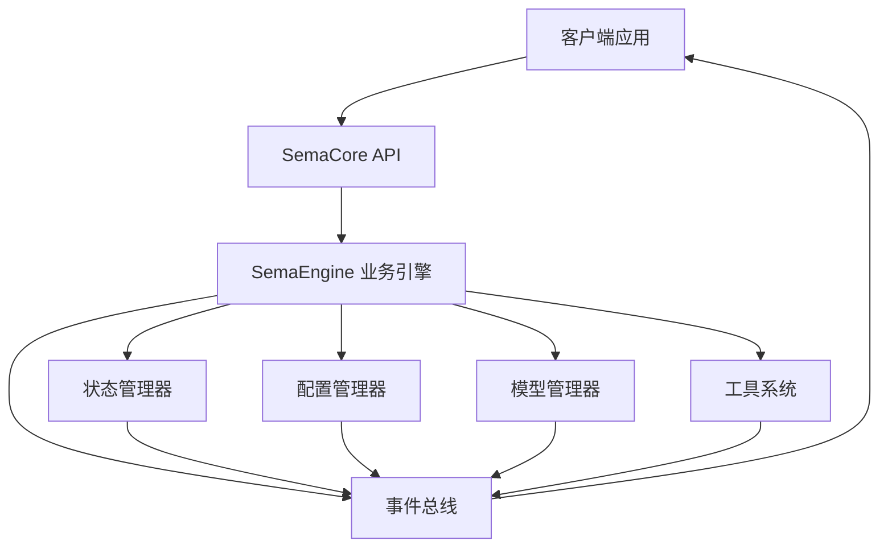
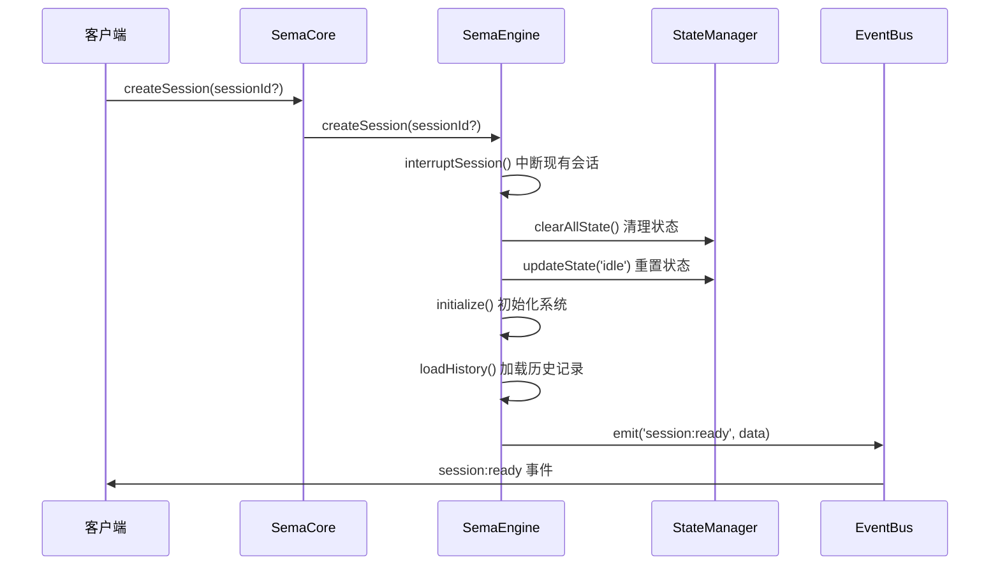

Now I have comprehensive understanding of the SemaCore API and its usage. Let me create the documentation:

# 基础用法与核心API

## 概述

SemaCore是一个基于事件驱动架构的AI对话核心引擎，提供简洁的公共接口用于创建AI会话、处理用户输入、管理模型配置和工具调用。本文档详细介绍SemaCore类的基本用法，包括会话创建、用户输入处理、事件监听和模型管理等核心功能。

SemaCore采用委托模式，将复杂的业务逻辑委托给内部的SemaEngine处理，对外暴露简洁统一的API接口。通过事件系统实现UI与核心逻辑的完全解耦，支持流式输出、工具权限管理、会话状态跟踪等高级功能。

## 架构设计

### 核心组件关系

SemaCore系统采用分层架构设计，主要包含以下核心组件：



### 设计模式

- **委托模式**: SemaCore将业务逻辑委托给SemaEngine处理 (core-0108-temp/src/core/SemaCore.ts:18-91)
- **单例模式**: EventBus、ConfigManager等核心组件采用单例模式确保全局状态一致性 (core-0108-temp/src/events/EventSystem.ts:74-82)
- **事件驱动**: 通过EventBus实现组件间解耦通信 (core-0108-temp/src/events/EventSystem.ts:70-137)
- **状态机**: 会话状态管理采用状态机模式 (core-0108-temp/docs/event.md:60-66)

## 实现细节

### SemaCore类初始化

SemaCore类的构造函数负责系统初始化和配置设置：

```typescript
constructor(config?: SemaCoreConfig) {
  this.configPromise = getConfManager().setCoreConfig(config || {});
  this.engine = new SemaEngine();
  
  this.configPromise = this.configPromise.then(async () => {
    await initMCPManager();
  });
}
```

初始化过程包含以下步骤 (core-0108-temp/src/core/SemaCore.ts:23-31)：

1. **配置设置**: 通过ConfigManager设置核心配置
2. **引擎创建**: 实例化SemaEngine业务引擎
3. **MCP初始化**: 异步初始化MCP(Model Context Protocol)管理器

### 配置管理系统

SemaCoreConfig接口定义了系统的核心配置选项 (core-0108-temp/src/types/index.ts:1-11)：

```typescript
export interface SemaCoreConfig {
  workingDir?: string;              // 项目绝对路径
  logLevel?: 'debug' | 'info' | 'warn' | 'error' | 'none';
  stream?: boolean;                 // 流式输出AI响应，默认 是
  thinking?: boolean;               // 流式输出AI响应，默认 否
  systemPrompt?: string;            // 系统提示
  customRules?: string;             // 用户规则
  skipFileEditPermission?: boolean; // 是否跳过文件编辑权限检查
  skipBashExecPermission?: boolean; // 是否跳过bash执行权限检查
  enableLLMCache?: boolean;         // 是否开启LLM缓存
  useTools?: string[] | null;       // 限定使用的工具
}
```

ConfigManager提供动态配置更新能力 (core-0108-temp/src/core/ConfManager.ts:70-88)，支持运行时修改特定配置字段而无需重启系统。

### 会话生命周期管理

#### 会话创建流程



createSession方法实现了完整的会话初始化流程 (core-0108-temp/src/core/SemaEngine.ts:40-91)：

1. **会话中断**: 完全中止当前会话（如果存在）
2. **状态清理**: 清理所有旧会话资源
3. **状态重置**: 重置状态为'idle'
4. **系统初始化**: 初始化新会话环境
5. **历史加载**: 加载会话历史数据
6. **技能注册**: 初始化技能注册表
7. **事件通知**: 发送session:ready事件

#### 用户输入处理

processUserInput方法处理用户输入并启动AI对话流程 (core-0108-temp/src/core/SemaEngine.ts:108-125)：

```typescript
async processUserInput(input: string, originalInput?: string): Promise<FileReferenceInfo[]> {
  this.stateManager.updateState('processing');
  
  // 检查是否为清空命令
  if (input.trim() === '/clear') {
    await this.handleClearCommand();
    return [];
  }

  // 先处理文件引用以获取补充信息
  const fileReferencesResult = await processFileReferences(
    input,
    this.stateManager.readFileTimestamps
  );

  // 立即启动后台查询处理，不等待结果
  this.processQueryInBackground(input, originalInput, fileReferencesResult);

  // 立即返回文件引用信息
  return fileReferencesResult.supplementaryInfo;
}
```

该方法采用异步处理模式，立即返回文件引用信息，同时在后台启动AI查询处理，提升响应性能。

### 事件系统架构

#### 事件总线实现

EventBus采用单例模式实现全局事件管理 (core-0108-temp/src/events/EventSystem.ts:70-137)：

```typescript
export class EventBus implements EventBusInterface {
  private static instance: EventBus | null = null;
  private readonly emitter = new EventEmitter();

  static getInstance(): EventBus {
    if (!EventBus.instance) {
      EventBus.instance = new EventBus();
    }
    return EventBus.instance;
  }
}
```

#### 核心事件类型

系统定义了完整的事件类型体系 (core-0108-temp/src/events/types.ts:30-140)：

**会话生命周期事件**:
- `session:ready`: 会话创建并准备就绪
- `session:interrupted`: 会话被中断
- `session:cleared`: 会话被清除
- `session:error`: 会话发生错误

**状态管理事件**:
- `state:update`: Core内部状态变化

**AI消息事件**:
- `message:chunk`: AI响应流式输出片段
- `message:complete`: AI响应完成

**工具相关事件**:
- `tool:permission:request`: 请求工具执行权限
- `tool:execution:complete`: 工具执行完成
- `tool:execution:error`: 工具执行错误

## 代码示例

### 基础使用示例

```typescript
import { SemaCore } from './core/SemaCore';

// 创建SemaCore实例
const core = new SemaCore({
  workingDir: '/path/to/project',
  logLevel: 'info',
  stream: true,
  thinking: false,
  skipFileEditPermission: false,
  skipBashExecPermission: false
});

// 监听会话就绪事件
core.on('session:ready', (data) => {
  console.log('会话已创建:', data.sessionId);
  console.log('工作目录:', data.workingDir);
  console.log('历史已加载:', data.historyLoaded);
});

// 监听AI消息流
core.on('message:chunk', (data) => {
  if (data.type === 'text') {
    process.stdout.write(data.delta); // 流式输出
  }
});

// 监听消息完成
core.on('message:complete', (data) => {
  console.log('\nAI响应完成');
  if (data.hasToolCalls) {
    console.log('包含工具调用:', data.toolCalls);
  }
});

// 创建会话
await core.createSession();

// 处理用户输入
const fileRefs = await core.processUserInput('帮我分析当前目录的Python文件');
console.log('文件引用信息:', fileRefs);
```

### 工具权限处理示例

```typescript
// 监听工具权限请求
core.on('tool:permission:request', (data) => {
  console.log(`工具 ${data.toolName} 请求执行权限:`);
  console.log(data.content);
  console.log('可选操作:', data.options);
  
  // 模拟用户选择
  const userChoice = 'agree'; // 或 'allow', 'refuse'
  
  // 响应权限请求
  core.respondToToolPermission({
    toolName: data.toolName,
    selected: userChoice
  });
});

// 监听工具执行完成
core.on('tool:execution:complete', (data) => {
  console.log(`工具 ${data.toolName} 执行完成:`);
  console.log('摘要:', data.summary);
  console.log('详细结果:', data.content);
});
```

### 模型管理示例

```typescript
// 添加新模型
const modelData = await core.addModel({
  provider: 'openai',
  modelName: 'gpt-4',
  baseURL: 'https://api.openai.com/v1',
  apiKey: 'sk-...',
  maxTokens: 4096,
  contextLength: 8192
});

console.log('当前主模型:', modelData.modelName);
console.log('可用模型列表:', modelData.modelList);

// 切换模型
await core.switchModel('gpt-4[openai]');

// 配置任务模型
await core.applyTaskModel({
  main: 'gpt-4[openai]',
  quick: 'gpt-3.5-turbo[openai]'
});
```

### 会话中断处理

```typescript
// 设置键盘中断监听
process.on('SIGINT', () => {
  console.log('检测到Ctrl+C，正在中断会话...');
  core.interruptSession();
});

// 监听会话中断事件
core.on('session:interrupted', (data) => {
  console.log('会话已中断:', data.content);
});

// 监听状态更新
core.on('state:update', (data) => {
  if (data.state === 'idle') {
    console.log('系统空闲，可以接受新输入');
  } else if (data.state === 'processing') {
    console.log('AI正在处理中...');
  }
});
```

## 技术考量

### 性能优化

1. **异步处理**: processUserInput采用异步处理模式，立即返回文件引用信息，后台处理AI查询 (core-0108-temp/src/core/SemaEngine.ts:120-125)
2. **流式输出**: 支持流式输出减少用户等待时间 (core-0108-temp/src/types/index.ts:4)
3. **缓存机制**: 可选的LLM缓存减少重复请求 (core-0108-temp/src/types/index.ts:10)
4. **状态管理**: 高效的状态管理避免不必要的重复计算

### 错误处理策略

系统实现了多层次的错误处理机制：

1. **会话级错误**: 通过session:error事件通知客户端 (core-0108-temp/docs/event.md:44-54)
2. **工具执行错误**: 通过tool:execution:error事件处理 (core-0108-temp/docs/event.md:150-156)
3. **中断处理**: 支持用户主动中断和异常中断 (core-0108-temp/src/core/SemaEngine.ts:234-242)
4. **配置错误**: 配置验证和错误恢复机制

### 安全考虑

1. **权限控制**: 文件编辑和bash执行需要用户确认 (core-0108-temp/src/types/index.ts:8-9)
2. **工具权限**: 工具执行前需要用户授权 (core-0108-temp/docs/event.md:120-132)
3. **输入验证**: 对用户输入进行安全验证
4. **资源隔离**: 会话间状态完全隔离

## 开发者指南

### 扩展SemaCore

开发者可以通过以下方式扩展SemaCore功能：

1. **自定义工具**: 实现Tool基类创建新的工具 (core-0108-temp/src/tools/base/Tool.ts)
2. **事件监听**: 监听系统事件实现自定义逻辑
3. **配置扩展**: 通过SemaCoreConfig添加新的配置选项
4. **MCP集成**: 通过MCP协议集成外部服务

### 常见任务流程

**创建新会话**:
```typescript
await core.createSession(); // 创建新会话
// 或
await core.createSession('existing-session-id'); // 加载历史会话
```

**处理用户输入**:
```typescript
const fileRefs = await core.processUserInput('用户输入内容');
// 系统自动处理AI响应和工具调用
```

**动态配置更新**:
```typescript
core.updateCoreConfByKey('stream', true);
core.updateUseTools(['FileReadTool', 'BashTool']);
```

### 测试策略

系统提供了完整的测试支持 (core-0108-temp/test/toolcall.test.js:1-100)：

1. **单元测试**: 测试各个组件的独立功能
2. **集成测试**: 测试组件间的协作
3. **端到端测试**: 测试完整的用户交互流程
4. **性能测试**: 测试系统在高负载下的表现

## 参考文献

- SemaCore核心实现: (core-0108-temp/src/core/SemaCore.ts:18-91)
- SemaEngine业务引擎: (core-0108-temp/src/core/SemaEngine.ts:23-337)
- 配置管理系统: (core-0108-temp/src/core/ConfManager.ts:14-328)
- 事件系统架构: (core-0108-temp/src/events/EventSystem.ts:70-137)
- 事件类型定义: (core-0108-temp/src/events/types.ts:30-140)
- API文档: (core-0108-temp/docs/api.md:1-337)
- 事件设计文档: (core-0108-temp/docs/event.md:1-207)
- 配置类型定义: (core-0108-temp/src/types/index.ts:1-105)