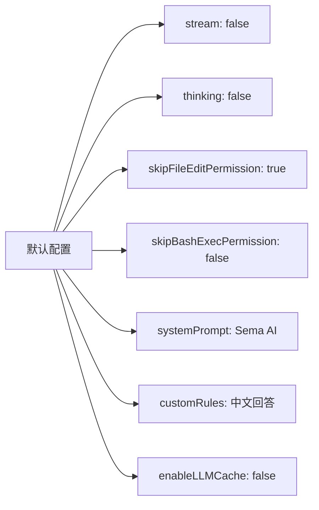
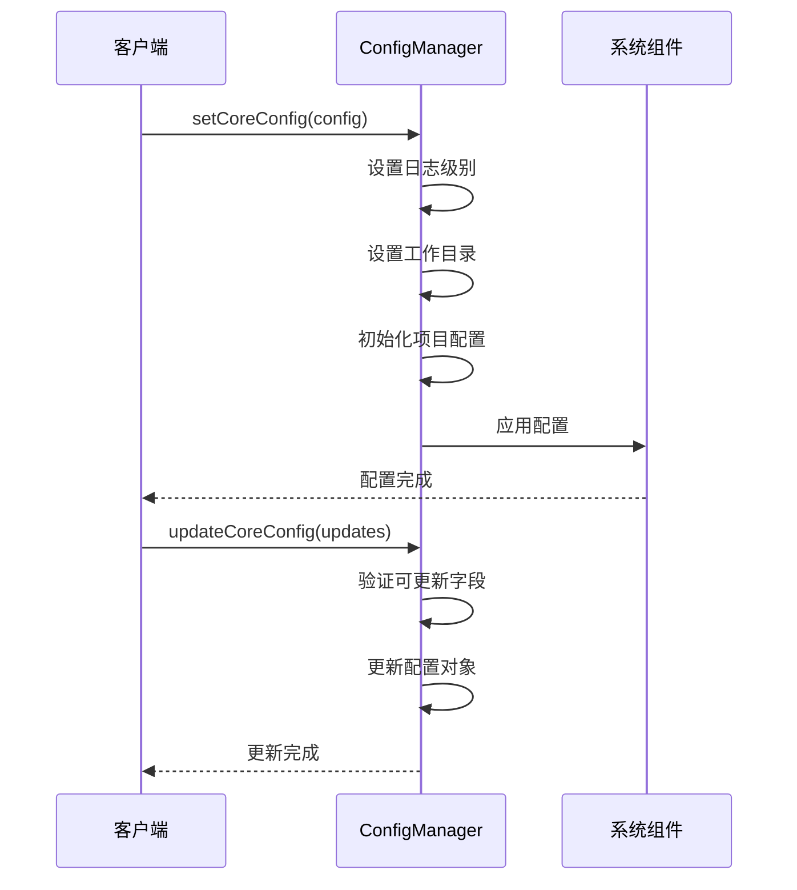

Now I have comprehensive information about the SemaCoreConfig. Let me create the documentation:

# 配置参考

## 概述

SemaCoreConfig 是 Sema 核心系统的主要配置接口，用于控制系统的各个方面，包括工作目录、日志级别、流式输出、权限设置和工具限制等。该配置系统支持动态更新，允许在运行时修改大部分配置项。

## 配置接口结构

```mermaid
graph TB
    SemaCoreConfig[SemaCoreConfig] --> Basic[基础配置]
    SemaCoreConfig --> Output[输出配置]
    SemaCoreConfig --> Prompts[提示配置]
    SemaCoreConfig --> Permissions[权限配置]
    SemaCoreConfig --> Tools[工具配置]
    
    Basic --> workingDir[workingDir: string?]
    Basic --> logLevel[logLevel: LogLevel?]
    
    Output --> stream[stream: boolean?]
    Output --> thinking[thinking: boolean?]
    
    Prompts --> systemPrompt[systemPrompt: string?]
    Prompts --> customRules[customRules: string?]
    
    Permissions --> skipFileEditPermission[skipFileEditPermission: boolean?]
    Permissions --> skipBashExecPermission[skipBashExecPermission: boolean?]
    
    Tools --> useTools[useTools: string[] | null?]
    Tools --> enableLLMCache[enableLLMCache: boolean?]
```

## 配置选项详解

### 基础配置

#### workingDir
- **类型**: `string?`
- **描述**: 项目绝对路径，设置系统的工作目录
- **默认值**: 当前工作目录
- **用途**: 
  - 设置原始工作目录（静态值，一旦设置就不会改变）
  - 设置当前工作目录（动态值，会随着shell目录切换而更新）
  - 为文件操作提供基准路径

**实现细节** (core-0108-temp/src/core/ConfManager.ts:35-45):
```typescript
// 如果 workingDir 未提供，使用当前工作目录
const workingDir = config.workingDir || getCwd();
this.projecName = workingDir;

if (config.workingDir) {
  // 设置原始工作目录（静态值，一旦设置就不会改变）
  setOriginalCwd(workingDir);
  // 设置当前工作目录（动态值，会随着shell目录切换而更新）
  await setCwd(workingDir);
}
```

#### logLevel
- **类型**: `'debug' | 'info' | 'warn' | 'error' | 'none'`
- **描述**: 日志输出级别
- **默认值**: `'info'`
- **级别优先级**: debug(0) < info(1) < warn(2) < error(3) < none(999)

**日志级别映射** (core-0108-temp/src/util/log.ts:9-15):
```typescript
const LOG_LEVELS: Record<LogLevel, number> = {
  debug: 0,
  info: 1,
  warn: 2,
  error: 3,
  none: 999 // 最高级别，禁用所有日志
};
```

### 输出配置

#### stream
- **类型**: `boolean?`
- **描述**: 流式输出AI响应
- **默认值**: `false`
- **用途**: 控制是否以流式方式输出AI响应，提供实时反馈

#### thinking
- **类型**: `boolean?`
- **描述**: 流式输出AI思考过程
- **默认值**: `false`
- **用途**: 控制是否显示AI的思考过程，用于调试和理解AI决策

### 提示配置

#### systemPrompt
- **类型**: `string?`
- **描述**: 系统提示词
- **默认值**: `"You are Sema, AIRC's Agent AI for coding."`
- **用途**: 定义AI的基础行为和角色

**系统提示生成** (core-0108-temp/src/services/api/genSystemPrompt.ts:60-70):
```typescript
function getProductSyspromptPrefix(): string {
  try {
    const configManager = getConfManager();
    const coreConfig = configManager.getCoreConfig();

    if (coreConfig?.systemPrompt) {
      return coreConfig.systemPrompt;
    }
  } catch (error) {
  }

  // 如果没有配置自定义 systemPrompt，使用默认值
  return `You are ${PRODUCT_NAME}, ${GROUP}'s Agent AI for coding.`;
}
```

#### customRules
- **类型**: `string?`
- **描述**: 用户自定义规则
- **默认值**: `"- 中文回答"`
- **用途**: 添加用户特定的行为规则和约束

**规则应用** (core-0108-temp/src/util/rules.ts:45-50):
```typescript
// 尝试从配置管理器中获取自定义的 customRules
const configManager = getConfManager()
const coreConfig = configManager.getCoreConfig()

if (coreConfig?.systemPrompt) {
  content = content ? `${content}\n\n${coreConfig.systemPrompt}` : coreConfig.systemPrompt
}
```

### 权限配置

#### skipFileEditPermission
- **类型**: `boolean?`
- **描述**: 是否跳过文件编辑权限检查
- **默认值**: `true`
- **用途**: 控制文件编辑工具是否需要用户确认

**权限检查逻辑** (core-0108-temp/src/core/PermissionManager.ts:65-75):
```typescript
// 文件编辑工具权限检查
if (isFileEditTool(tool)) {
  if (coreConfig?.skipFileEditPermission) {
    logDebug(`[Permission]${tool.name} 跳过编辑检查`)
    return {result: true }
  }

  const stateManager = getStateManager()
  if (stateManager.hasGlobalEditPermission()) {
    // 项目内直接读取，项目外需要请求权限
    const filePath = getFilePath(input)
    if (!filePath || isFileInAuthorizedScope(filePath)) {
      return { result: true }
    }
  }
}
```

#### skipBashExecPermission
- **类型**: `boolean?`
- **描述**: 是否跳过bash执行权限检查
- **默认值**: `false`
- **用途**: 控制bash命令执行是否需要用户确认

**Bash权限检查** (core-0108-temp/src/core/PermissionManager.ts:85-90):
```typescript
// Bash 工具权限检查
if (tool.name === BashTool.name) {
  if (coreConfig?.skipBashExecPermission) return { result: true }

  const allowedTools = projectConfig?.allowedTools || []
  const { command } = inputSchema.parse(input)
  return await checkBashPermission(tool, command, abortController, allowedTools)
}
```

### 工具配置

#### useTools
- **类型**: `string[] | null?`
- **描述**: 限定使用的工具列表
- **默认值**: `null`（使用所有工具）
- **用途**: 限制系统可用的工具集合

**工具过滤逻辑** (core-0108-temp/src/tools/base/tools.ts:49-58):
```typescript
export const getTools = memoize(
  async (useTools?: string[] | null): Promise<Tool[]> => {
    const allTools = getAllTools()

    // 如果没有指定 useTools 或为 null，返回所有工具
    if (!useTools) {
      return allTools
    }

    // 根据 useTools 过滤工具
    return allTools.filter(tool => useTools.includes(tool.name))
  }
)
```

#### enableLLMCache
- **类型**: `boolean?`
- **描述**: 是否开启LLM缓存
- **默认值**: `false`
- **用途**: 仅在测试时使用，缓存LLM响应以提高性能

## 配置管理

### 动态更新支持

系统支持运行时动态更新以下配置项 (core-0108-temp/src/types/index.ts:15):
```typescript
export type UpdatableCoreConfigKeys = 'stream' | 'thinking' | 'systemPrompt' | 'customRules' | 'skipFileEditPermission' | 'skipBashExecPermission' | 'enableLLMCache';
```

### 默认配置



**默认配置定义** (core-0108-temp/src/types/index.ts:18-25):
```typescript
export const defaultCoreConfig = {
  stream: false,
  thinking: false,
  skipFileEditPermission: true,
  skipBashExecPermission: false,
  systemPrompt: "You are Sema, AIRC's Agent AI for coding.",
  customRules: "- 中文回答",
  enableLLMCache: false
};
```

### 配置更新方法

#### 单字段更新
```typescript
updateCoreConfByKey<K extends UpdatableCoreConfigKeys>(key: K, value: SemaCoreConfig[K]): void
```

#### 批量更新
```typescript
updateCoreConfig(config: UpdatableCoreConfig): void
```

#### 工具列表更新
```typescript
updateUseTools(toolNames: string[] | null): void
```

## 配置流程



## 权限系统集成

配置系统与权限管理紧密集成，通过 `skipFileEditPermission` 和 `skipBashExecPermission` 控制工具使用权限：

1. **文件编辑权限**: 控制文件编辑工具（FileEditTool、MultiEditTool、FileWriteTool、NotebookEditTool）的权限检查
2. **Bash执行权限**: 控制bash命令执行的权限检查
3. **安全命令白名单**: 系统维护安全命令白名单，无需权限检查

## 最佳实践

1. **开发环境**: 设置 `skipFileEditPermission: true` 和 `logLevel: 'debug'` 以提高开发效率
2. **生产环境**: 保持默认权限设置，确保安全性
3. **工具限制**: 使用 `useTools` 限制可用工具集合，提高安全性
4. **自定义提示**: 通过 `systemPrompt` 和 `customRules` 定制AI行为
5. **流式输出**: 在需要实时反馈的场景中启用 `stream` 和 `thinking`

## 参考资料

- 配置接口定义: `core-0108-temp/src/types/index.ts:1-25`
- 默认值定义: `core-0108-temp/src/types/index.ts:18-25`
- 配置管理器: `core-0108-temp/src/core/ConfManager.ts`
- 权限管理: `core-0108-temp/src/core/PermissionManager.ts`
- 工具过滤: `core-0108-temp/src/tools/base/tools.ts`