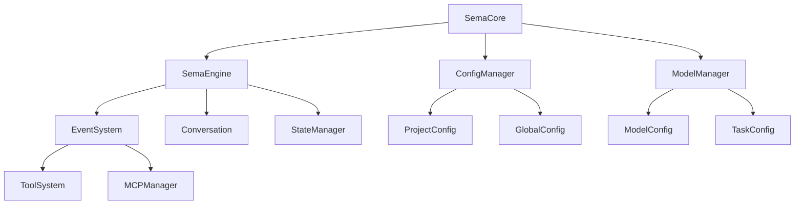

Based on my comprehensive analysis of the codebase, I'll now generate the installation and environment setup documentation.

# 安装与环境配置

## 概述

Sema Core 是一个基于 TypeScript 的事件驱动 AI 助手核心库，为 AIRC Sema 团队开发。本文档将指导您完成项目的安装、环境配置和基本设置，确保您能够成功运行和开发 Sema Core 应用程序。

## 系统要求

### Node.js 版本要求
- **Node.js 16.0.0 或更高版本** (core-0108-temp/package.json:83-85)
- 推荐使用 Node.js 18+ 以获得更好的性能和稳定性

### 操作系统支持
项目支持跨平台运行，包括：
- **Windows** (Windows 10/11)
- **macOS** (macOS 10.15+)
- **Linux** (Ubuntu 18.04+, CentOS 7+)

### 开发工具
- **TypeScript 5.0+** - 用于类型检查和编译
- **npm** - 包管理器（随 Node.js 安装）
- **Git** - 版本控制（可选，用于克隆仓库）

## 快速安装

### 1. 克隆项目（可选）
```bash
git clone https://github.com/airc/sema-core.git
cd sema-core
```

### 2. 安装依赖
```bash
npm install
```

### 3. 编译项目
```bash
npm run build
```

### 4. 验证安装
```bash
# 运行基础测试
node test/session.test.js

# 运行工具测试
node test/tool/grep.test.js
```

## 详细安装步骤

### 依赖包安装

项目使用 npm 作为包管理器，所有依赖都在 `package.json` 中定义 (core-0108-temp/package.json:40-62)：

#### 核心依赖
- **@anthropic-ai/sdk**: Anthropic AI API 客户端
- **@modelcontextprotocol/sdk**: 模型上下文协议支持
- **openai**: OpenAI API 客户端
- **zod**: 类型验证库
- **events**: Node.js 事件系统

#### 工具依赖
- **@vscode/ripgrep**: 高性能文本搜索
- **glob**: 文件模式匹配
- **diff**: 文件差异比较
- **shell-quote**: Shell 命令转义

#### 开发依赖
- **typescript**: TypeScript 编译器
- **@types/node**: Node.js 类型定义
- **eslint**: 代码质量检查
- **ts-node**: TypeScript 直接执行

### TypeScript 编译配置

项目使用 TypeScript 进行开发，编译配置位于 `tsconfig.json` (core-0108-temp/tsconfig.json:1-25)：

```json
{
  "compilerOptions": {
    "target": "ES2021",
    "module": "commonjs",
    "lib": ["ES2021"],
    "outDir": "./dist",
    "rootDir": "./src",
    "declaration": true,
    "declarationMap": true,
    "sourceMap": true,
    "strict": true,
    "esModuleInterop": true,
    "skipLibCheck": true,
    "forceConsistentCasingInFileNames": true,
    "moduleResolution": "node",
    "resolveJsonModule": true
  },
  "include": ["src/**/*"],
  "exclude": ["node_modules", "dist", "tests", "examples"]
}
```

### 构建脚本

项目提供了以下 npm 脚本 (core-0108-temp/package.json:75-83)：

```json
{
  "scripts": {
    "build": "tsc",
    "lint": "eslint src/**/*.ts",
    "prepublishOnly": "npm run build"
  }
}
```

## 环境配置

### 环境变量设置

#### 可选环境变量
- **`SEMA_ROOT`**: 自定义 Sema 数据存储目录 (core-0108-temp/src/util/savePath.ts:20)
  ```bash
  export SEMA_ROOT="/custom/path/to/sema"
  ```

- **`USE_BUILTIN_RIPGREP`**: 使用内置 ripgrep 工具 (core-0108-temp/src/util/ripgrep.ts:8)
  ```bash
  export USE_BUILTIN_RIPGREP=1
  ```

- **`SHELL`**: 指定 Shell 环境（Windows 下的 Bash 路径）(core-0108-temp/src/util/shell.ts:139)

#### API 密钥配置
项目支持多种 AI 服务提供商，需要相应的 API 密钥：
- OpenAI API Key
- Anthropic API Key
- 其他自定义 API 端点的密钥

### 目录结构初始化

首次运行时，系统会自动创建以下目录结构 (core-0108-temp/src/constants/config.ts:1-28)：

```
~/.sema/                    # 默认数据目录
├── model.conf              # 模型配置文件
├── projects.conf           # 项目配置文件
├── history/                # 会话历史记录
├── logs/                   # 服务日志
├── llm_logs/              # LLM 调用日志
└── tracks/                # 调用轨迹归档
```

## 基本配置

### 核心配置选项

创建 SemaCore 实例时可以传入配置对象 (core-0108-temp/src/types/index.ts:1-11)：

```typescript
interface SemaCoreConfig {
  workingDir?: string;              // 项目绝对路径
  logLevel?: 'debug' | 'info' | 'warn' | 'error' | 'none';
  stream?: boolean;                 // 流式输出AI响应，默认 false
  thinking?: boolean;               // 显示AI思考过程，默认 false
  systemPrompt?: string;            // 系统提示
  customRules?: string;             // 用户规则
  skipFileEditPermission?: boolean; // 跳过文件编辑权限检查
  skipBashExecPermission?: boolean; // 跳过bash执行权限检查
  enableLLMCache?: boolean;         // 启用LLM缓存（测试用）
  useTools?: string[] | null;       // 限定使用的工具
}
```

### 默认配置

系统提供默认配置 (core-0108-temp/src/types/index.ts:16-24)：

```typescript
const defaultCoreConfig = {
  stream: false,
  thinking: false,
  skipFileEditPermission: true,
  skipBashExecPermission: false,
  systemPrompt: "You are Sema, AIRC's Agent AI for coding.",
  customRules: "- 中文回答",
  enableLLMCache: false
};
```

## 开发环境设置

### 开发流程


### 1. 开发环境准备
```bash
# 克隆项目
git clone https://github.com/airc/sema-core.git
cd sema-core

# 安装依赖
npm install

# 编译项目
npm run build
```

### 2. 代码质量检查
```bash
# 运行 ESLint 检查
npm run lint

# 修复可自动修复的问题
npx eslint src/**/*.ts --fix
```

### 3. 测试环境配置

#### 基础功能测试
```bash
# 工具API测试
node test/utilApi.test.js
# 注意：需要配置有效的 apiKey

# 模型管理测试
node test/model.test.js
# 注意：需要配置有效的 apiKey

# 简单会话测试
node test/session.test.js
```

#### 高级功能测试
```bash
# 多轮对话测试
node test/multiturn.test.js

# 工具调用测试（重要）
node test/toolcall.test.js

# 任务规划测试（重要）
node test/todos.test.js
```

#### 工具执行测试
```bash
# 文本搜索工具
node test/tool/grep.test.js

# 文件匹配工具
node test/tool/glob.test.js

# Bash执行工具
node test/tool/bash.test.js
```

#### MCP 服务测试
```bash
# MCP 服务连接测试
node test/mcp/mcp.test.js

# MCP 工具执行测试
node test/mcp/mcpTool.test.js

# MCP 工具使用场景测试
node test/mcp/mcpToolUse.test.js
```

## 项目架构

### 目录结构

```
sema-core/
├── src/
│   ├── core/           # 核心业务逻辑
│   ├── events/         # 事件系统
│   ├── services/       # 服务层（API、MCP等）
│   ├── tools/          # 工具系统
│   ├── types/          # 类型定义
│   ├── util/           # 工具函数
│   └── constants/      # 常量定义
├── test/               # 测试文件
├── docs/               # 文档
└── dist/               # 编译输出
```

### 核心组件



## 使用示例

### 基本使用

```typescript
import { SemaCore } from 'sema-core';

async function basicExample() {
  // 1. 创建 SemaCore 实例
  const sema = new SemaCore({
    workingDir: '/path/to/your/project',
    logLevel: 'info',
    stream: true,
    thinking: true
  });

  try {
    // 2. 创建会话
    await sema.createSession();
    console.log('会话创建成功！');

    // 3. 处理用户输入
    await sema.processUserInput('你好，帮我分析一下这个项目的结构');
    await sema.processUserInput('请帮我修复代码中的bug');

  } catch (error) {
    console.error('操作失败:', error);
  } finally {
    // 4. 清理资源
    await sema.dispose();
  }
}
```

### 事件监听

```typescript
// 监听会话事件
sema.on('session:ready', (data) => {
  console.log('会话已就绪:', data);
});

// 监听消息流
sema.on('message:chunk', (data) => {
  if (data.type === 'text') {
    console.log('AI响应:', data.delta);
  }
});

// 监听工具权限请求
sema.on('tool:permission:request', (data) => {
  // 处理权限请求
  sema.respondToToolPermission({
    toolName: data.toolName,
    selected: 'agree'
  });
});
```

## 常见问题解决

### 安装问题

#### Node.js 版本不兼容
```bash
# 检查 Node.js 版本
node --version

# 使用 nvm 安装正确版本
nvm install 18
nvm use 18
```

#### 依赖安装失败
```bash
# 清理缓存
npm cache clean --force

# 删除 node_modules 重新安装
rm -rf node_modules package-lock.json
npm install
```

### 编译问题

#### TypeScript 编译错误
```bash
# 检查 TypeScript 版本
npx tsc --version

# 重新安装 TypeScript
npm install typescript@latest --save-dev

# 清理编译输出重新构建
rm -rf dist
npm run build
```

### 运行时问题

#### 权限错误
```bash
# Linux/macOS 下设置执行权限
chmod +x node_modules/.bin/*

# Windows 下以管理员身份运行
```

#### 环境变量问题
```bash
# 检查环境变量
echo $SEMA_ROOT
echo $NODE_ENV

# 设置环境变量
export SEMA_ROOT="/custom/path"
```

## 性能优化建议

### 开发环境
- 使用 SSD 存储提高 I/O 性能
- 分配足够的内存（建议 8GB+）
- 启用 TypeScript 增量编译

### 生产环境
- 禁用开发调试功能
- 配置适当的日志级别
- 使用 PM2 等进程管理器

## 下一步

完成安装和环境配置后，您可以：

1. 阅读 [API 文档](docs/api.md) 了解详细的接口使用方法
2. 查看 [使用案例](docs/case.md) 学习实际应用场景
3. 探索 [事件系统](docs/event.md) 了解事件驱动架构
4. 开始开发您的 AI 助手应用

## 技术支持

如果在安装或配置过程中遇到问题，请：

1. 检查 [常见问题解决](#常见问题解决) 部分
2. 查看项目的 GitHub Issues
3. 联系 AIRC Sema 团队获取技术支持

---

**注意**: 本文档基于 sema-core v1.0.1，不同版本可能存在差异。请确保使用与您的项目版本匹配的文档。