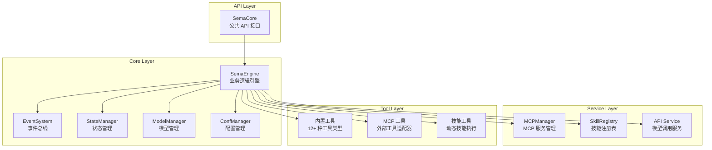
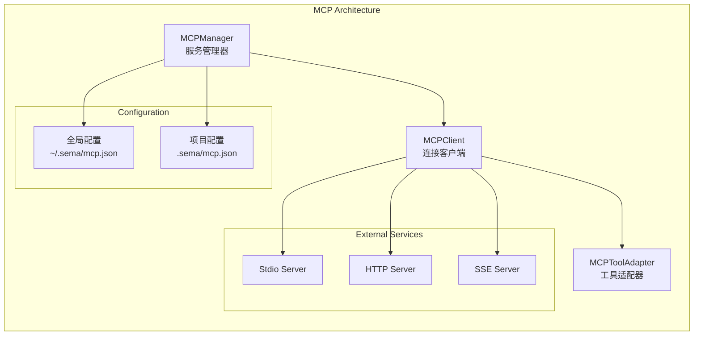

# Sema Core 项目概览与架构

## 概览

Sema Core 是一个基于 TypeScript/Node.js 的事件驱动 AI 助手核心库，专为构建可扩展的 AI 代理工具系统而设计。该项目提供了一个完整的框架，支持对话管理、工具集成、模型管理和 MCP（Model Context Protocol）集成，为开发者构建智能助手应用提供了强大的基础设施 (core-0108-temp/package.json:1-10, core-0108-temp/README.md:1-33)。

### 核心特性

- **事件驱动架构**：基于发布-订阅模式的异步事件系统，支持松耦合的组件通信
- **可扩展工具系统**：内置 12+ 种工具类型，支持文件操作、命令执行、搜索等功能
- **MCP 集成**：完整支持 Model Context Protocol，可连接外部服务和工具
- **对话管理**：智能的会话状态管理和消息历史处理
- **技能系统**：支持动态加载和执行自定义技能脚本
- **多模型支持**：兼容 OpenAI、Anthropic 等多种 AI 模型提供商

## 架构设计

### 整体架构

Sema Core 采用分层架构设计，将系统划分为核心层、服务层、工具层和类型定义层：



### 核心组件关系

#### 1. SemaCore - 统一 API 接口

SemaCore 是整个系统的入口点，提供简洁的公共接口，内部委托给 SemaEngine 处理具体业务逻辑 (core-0108-temp/src/core/SemaCore.ts:16-91)：

- **会话管理**：`createSession()`, `processUserInput()`, `interruptSession()`
- **模型管理**：`addModel()`, `delModel()`, `switchModel()`
- **配置管理**：`updateCoreConfig()`, `updateUseTools()`
- **MCP 管理**：`addOrUpdateMCPServer()`, `removeMCPServer()`
- **事件接口**：`on()`, `once()`, `off()`, `respondToToolPermission()`

#### 2. SemaEngine - 核心业务引擎

SemaEngine 是系统的核心业务逻辑处理器，负责协调各个组件完成复杂的 AI 对话流程 (core-0108-temp/src/core/SemaEngine.ts:25-337)：

```typescript
export class SemaEngine {
  private readonly eventBus: EventBus;
  private readonly stateManager = getStateManager();

  // 核心会话创建流程
  async createSession(sessionId?: string): Promise<void> {
    // 1. 中断当前会话
    this.interruptSession();
    // 2. 清理所有旧会话资源
    this.stateManager.clearAllState();
    // 3. 重置状态
    this.stateManager.updateState('idle');
    // 4. 初始化新会话
    await this.initialize(sessionId);
    // 5. 初始化 Skill 注册表
    initializeSkillRegistry(workingDir);
  }
}
```

#### 3. EventSystem - 事件驱动核心

EventSystem 实现了完整的事件发布-订阅机制，支持组件间的松耦合通信 (core-0108-temp/src/events/EventSystem.ts:75-137)：

```typescript
export class EventBus implements EventBusInterface {
  private static instance: EventBus | null = null;
  private readonly emitter = new EventEmitter();

  static getInstance(): EventBus {
    if (!EventBus.instance) {
      EventBus.instance = new EventBus();
    }
    return EventBus.instance;
  }

  emit<T>(event: string, data: T): boolean {
    return this.emitter.emit(event, data);
  }
}
```

### 工具系统架构

#### 工具接口设计

所有工具都实现统一的 Tool 接口，确保一致的调用方式和扩展性 (core-0108-temp/src/tools/base/Tool.ts:14-55)：

```typescript
export interface Tool<TInput extends z.ZodObject<any> = z.ZodObject<any>, TOutput = any> {
  name: string;
  description?: string | (() => string);
  inputSchema: TInput;
  isReadOnly: () => boolean;
  validateInput?: (input: z.infer<TInput>) => Promise<ValidationResult>;
  genResultForAssistant: (output: TOutput) => string;
  call: (input: z.infer<TInput>) => AsyncGenerator<
    { type: 'result'; data: TOutput; resultForAssistant?: string },
    void,
    unknown
  >;
}
```

#### 工具分类与管理

系统支持三类工具，通过统一的工具管理器进行协调 (core-0108-temp/src/tools/base/tools.ts:38-61)：

1. **内置工具**：12 种核心工具，包括文件操作、命令执行、搜索等
2. **MCP 工具**：通过 MCP 协议连接的外部工具
3. **技能工具**：动态加载的自定义技能脚本

```typescript
// 获取所有工具（内置 + MCP）
export const getAllTools = (): Tool[] => {
  const builtinTools = getBuiltinTools();
  const mcpTools = getMCPManager().getMCPTools();
  return [...builtinTools, ...mcpTools];
};
```

### MCP 集成架构

#### MCP 管理器设计

MCPManager 采用单例模式，支持全局和项目级别的 MCP 服务器配置管理 (core-0108-temp/src/services/mcp/MCPManager.ts:28-500)：



#### 工具缓存与增量更新

MCPManager 实现了智能的工具缓存机制，支持增量更新以提高性能：

```typescript
interface ToolsCache {
  globalMtime: number;
  projectMtime: number;
  toolsByServer: Map<string, Tool[]>;
}

// 检查缓存是否有效
private isCacheValid(): boolean {
  if (!this.toolsCache) return false;
  
  const globalMtime = this.getFileMtime(this.globalConfigPath);
  const projectMtime = this.getFileMtime(this.projectConfigPath);
  
  return (
    this.toolsCache.globalMtime === globalMtime &&
    this.toolsCache.projectMtime === projectMtime
  );
}
```

### 技能系统架构

#### 技能注册与发现

技能系统支持项目级和全局级技能的自动发现和注册 (core-0108-temp/src/services/skill/skillRegistry.ts:17-91)：

```typescript
export function initializeSkillRegistry(workingDir: string): SkillRegistry {
  const registry: SkillRegistry = new Map();
  const skills = loadAllSkills(workingDir);

  for (const skill of skills) {
    const name = skill.metadata.name;
    
    // 项目级技能覆盖全局级技能
    if (registry.has(name)) {
      const existingSkill = registry.get(name)!;
      logWarn(`Duplicate skill name detected: ${name}. Using ${skill.filePath} (override ${existingSkill.filePath})`);
    }
    
    registry.set(name, skill);
  }

  globalRegistry = registry;
  return registry;
}
```

## 实现细节

### 对话流程管理

#### 异步消息处理

系统采用 AsyncGenerator 模式处理复杂的对话流程，支持流式响应和中断控制 (core-0108-temp/src/core/Conversation.ts:32-500)：

```typescript
export async function* query(
  messages: Message[],
  systemPromptContent: Array<{ type: 'text', text: string }>,
  abortController: AbortController,
  tools: Tool[],
): AsyncGenerator<Message, void> {
  
  // 获取助手响应
  const assistantMessage = await queryLLM(
    normalizeMessagesForAPI(messages),
    systemPromptContent,
    abortController.signal,
    tools
  );

  // 检查点1: AI响应完成后工具执行前
  if (abortController.signal.aborted) {
    yield createAssistantMessage(INTERRUPT_MESSAGE);
    return;
  }

  yield assistantMessage;

  // 处理工具调用...
}
```

#### 工具执行策略

系统根据工具的只读性质自动选择并发或串行执行策略：

```typescript
// 检查所有工具是否都可以并发运行（只读工具）
const canRunConcurrently = toolUseMessages.every(msg =>
  tools.find(t => t.name === msg.name)?.isReadOnly?.() ?? false,
);

// 根据是否可以并发运行选择不同的执行策略
if (canRunConcurrently) {
  for await (const message of runToolsConcurrently(
    toolUseMessages, assistantMessage, abortController, tools,
  )) {
    yield message;
  }
} else {
  for await (const message of runToolsSerially(
    toolUseMessages, assistantMessage, abortController, tools
  )) {
    yield message;
  }
}
```

### 状态管理与持久化

#### 会话状态管理

StateManager 负责管理会话的完整生命周期，包括消息历史、工作状态和中断控制：

```typescript
class StateManager {
  private sessionId: string = '';
  private messageHistory: Message[] = [];
  private todos: string[] = [];
  private state: 'idle' | 'processing' = 'idle';
  private hasInitQuery: boolean = false;
  private readFileTimestamps: Map<string, number> = new Map();
  public currentAbortController: AbortController | null = null;

  updateState(newState: 'idle' | 'processing'): void {
    this.state = newState;
    // 状态变为 idle 时自动触发会话存储
    if (newState === 'idle') {
      this.saveSessionInBackground();
    }
  }
}
```

### 权限管理系统

#### 工具权限检查

系统实现了完整的权限管理机制，确保敏感操作需要用户确认：

```typescript
// 权限检查
if (!tool.isReadOnly?.()) {
  const permissionResult = await hasPermissionsToUseTool(
    tool,
    input as never,
    abortController,
    assistantMessage,
  );
  if (!permissionResult.result) {
    // 返回权限拒绝消息
    yield createUserMessage([{
      type: 'tool_result',
      content: permissionResult.message,
      is_error: true,
      tool_use_id: toolUseID,
    }]);
    return;
  }
}
```

## 技术考量

### 性能优化

#### 1. 工具缓存机制

- **Memoization**：使用 lodash-es 的 memoize 函数缓存工具构建结果
- **增量更新**：MCP 工具支持按服务器增量更新，避免全量重建
- **文件时间戳检查**：通过文件修改时间判断缓存有效性

#### 2. 异步处理优化

- **并发工具执行**：只读工具支持并发执行，提高响应速度
- **流式响应**：使用 AsyncGenerator 实现流式消息处理
- **后台任务**：话题检测等非关键任务在后台异步执行

### 安全考虑

#### 1. 输入验证

- **Zod Schema 验证**：所有工具输入都通过 Zod 进行严格类型检查
- **自定义验证**：每个工具可实现额外的业务逻辑验证
- **错误处理**：完善的错误捕获和用户友好的错误消息

#### 2. 权限控制

- **工具权限系统**：敏感操作需要用户明确授权
- **中断机制**：支持随时中断正在执行的操作
- **作用域隔离**：MCP 服务器支持全局和项目级别的配置隔离

### 错误处理策略

#### 1. 优雅降级

- **工具加载失败**：单个工具加载失败不影响其他工具
- **MCP 连接失败**：MCP 服务连接失败时功能降级，不阻塞主流程
- **技能加载异常**：技能系统初始化失败时记录警告但不中断会话创建

#### 2. 错误恢复

- **自动重试**：网络请求等临时性错误支持自动重试
- **状态恢复**：异常中断后能够恢复到一致的状态
- **错误上报**：通过事件系统向上层应用报告错误详情

## 开发者指南

### 如何扩展工具

#### 1. 创建自定义工具

```typescript
import { Tool } from '../base/Tool';
import { z } from 'zod';

export class CustomTool implements Tool {
  name = 'custom_tool';
  description = '自定义工具描述';
  
  inputSchema = z.object({
    param1: z.string().describe('参数1描述'),
    param2: z.number().optional().describe('可选参数2'),
  });

  isReadOnly = () => true; // 或 false，取决于工具是否修改系统状态

  async *call(input: z.infer<typeof this.inputSchema>) {
    // 工具实现逻辑
    const result = await processInput(input);
    
    yield {
      type: 'result' as const,
      data: result,
      resultForAssistant: this.genResultForAssistant(result)
    };
  }

  genResultForAssistant(output: any): string {
    return `处理结果：${JSON.stringify(output)}`;
  }
}
```

#### 2. 注册工具

将新工具添加到工具列表中：

```typescript
// 在 src/tools/base/tools.ts 中
export const getBuiltinTools = (): Tool[] => {
  return [
    // ... 现有工具
    CustomTool as unknown as Tool,
  ];
};
```

### 如何添加 MCP 服务器

#### 1. 配置 MCP 服务器

```typescript
const mcpConfig: MCPServerConfig = {
  name: 'my-server',
  transport: 'stdio',
  command: 'node',
  args: ['path/to/server.js'],
  enabled: true
};

// 添加到项目级配置
await semaCore.addOrUpdateMCPServer(mcpConfig, 'project');
```

#### 2. 连接和使用

```typescript
// 连接服务器
const status = await semaCore.connectMCPServer('my-server');

// 获取服务器信息
const servers = semaCore.getMCPServerConfigs();
```

### 常见任务和工作流

#### 1. 创建新会话

```typescript
const semaCore = new SemaCore({
  workingDir: '/path/to/project',
  logLevel: 'info',
  useTools: ['View', 'Edit', 'Bash'] // 指定可用工具
});

// 监听事件
semaCore.on('session:ready', (data) => {
  console.log('会话已就绪:', data);
});

// 创建会话
await semaCore.createSession();
```

#### 2. 处理用户输入

```typescript
// 处理用户输入
const fileReferences = await semaCore.processUserInput('请帮我分析这个文件');

// 监听消息完成事件
semaCore.on('message:complete', (data) => {
  console.log('AI 响应:', data.content);
  console.log('工具调用:', data.toolCalls);
});
```

#### 3. 管理模型配置

```typescript
// 添加新模型
const modelConfig = {
  name: 'gpt-4',
  provider: 'openai',
  apiKey: 'your-api-key',
  baseURL: 'https://api.openai.com/v1'
};

await semaCore.addModel(modelConfig);

// 切换模型
await semaCore.switchModel('gpt-4');
```

### 测试策略

#### 1. 单元测试

```typescript
// 测试工具功能
describe('CustomTool', () => {
  it('should process input correctly', async () => {
    const tool = new CustomTool();
    const input = { param1: 'test' };
    
    const generator = tool.call(input);
    const result = await generator.next();
    
    expect(result.value.type).toBe('result');
    expect(result.value.data).toBeDefined();
  });
});
```

#### 2. 集成测试

```typescript
// 测试完整流程
describe('SemaCore Integration', () => {
  it('should handle complete conversation flow', async () => {
    const semaCore = new SemaCore();
    await semaCore.createSession();
    
    const fileRefs = await semaCore.processUserInput('Hello');
    expect(fileRefs).toBeInstanceOf(Array);
  });
});
```

## 参考文献

- 核心配置：`core-0108-temp/package.json:1-83`
- 主入口：`core-0108-temp/src/index.ts:1`
- 核心 API：`core-0108-temp/src/core/SemaCore.ts:16-91`
- 业务引擎：`core-0108-temp/src/core/SemaEngine.ts:25-337`
- 事件系统：`core-0108-temp/src/events/EventSystem.ts:75-137`
- 工具接口：`core-0108-temp/src/tools/base/Tool.ts:14-55`
- 工具管理：`core-0108-temp/src/tools/base/tools.ts:38-61`
- MCP 管理：`core-0108-temp/src/services/mcp/MCPManager.ts:28-500`
- 技能注册：`core-0108-temp/src/services/skill/skillRegistry.ts:17-91`
- 对话管理：`core-0108-temp/src/core/Conversation.ts:32-500`